<h1 align="center">Euclides Emanuel Laurindo</h1>

  <a href="https://github.com/euclideslaurindo">
    <picture>
      <source media="(prefers-color-scheme: dark)" srcset="neofetch_dark.svg">
      
    </picture>
  </a>

 

###  Minhas Tecnologias

  
  
  
  
  
  
  
  
  
  
  
  
  
  
  
  
  
  
  
  
  
  
  

###  Contato

  
  
  

###

 

