  <a href="https://github.com/euclideslaurindo">
    <picture>
      <source media="(prefers-color-scheme: dark)" srcset="dark_mode.svg">
      
    </picture>
  </a>

 

  

---

### 📊 Minhas Estatísticas

  
  

